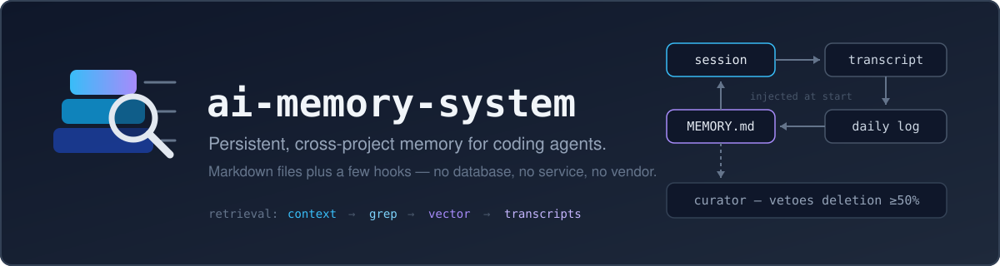

<p align="center">
  
</p>

<p align="center">
  <a href="LICENSE"></a>
  
  
  
  
  
</p>

# ai-memory-system

Persistent, cross-project memory for [Claude Code](https://claude.com/claude-code),
shared with [Codex](https://learn.chatgpt.com/docs/codex/cli).

Coding agents forget everything when a session ends. This adds a memory that
survives — written during work, curated on a schedule, and searchable when what
was loaded isn't enough.

Each repository gets its own store, and **that only governs what loads
automatically**. Search reaches across every project you have ever worked in, so
you can ask in one repo about something you decided in another.

**Claude Code gets all of it**, including the store loaded automatically at the
start of every session. **Codex shares the same store** — same repo anchoring,
its sessions captured into the same daily transcript, the same instructions
installed — but does not yet get the automatic load, because that needs a hook
Codex hasn't shipped to stable. Details and how to re-check:
[`docs/codex-support.md`](docs/codex-support.md).

It is markdown files plus a few hooks. No database, no service, no vendor.

## What it actually does

**Loads context automatically** (Claude Code). A `SessionStart` hook injects
~3,500 tokens:
your profile, cross-project gotchas, this project's memory, and today's log.
The store is keyed to the repo's git root, so a session started in
`repo/services/api` gets the same memory as one started in `repo/`.

**Records the work without being asked.** Every session is captured, and a
daily log — what was done, decided, and why — is written as the work happens. If
a long session ends without one, the agent is stopped and told to write it. Days
that were never logged get rebuilt later by distilling the raw transcripts. You
only speak up to promote something into permanent memory (*"remember this"*);
the recording itself is not your job.

**Keeps the injected set small on purpose.** Every layer has a character cap
(1,375 / 4,000 / 2,500). The cap is the whole design: startup context is the
most expensive tokens you spend, because you pay them in every session whether
or not you needed them. A project store can override its own with a
`context/.cap` file — one number for every store was a poor fit once a store
carried many topic pages, since the index alone grows with their count.
Malformed or missing, it falls back to the default, which is the stricter
value, so raising a cap stays deliberate rather than accidental.

**Splits instead of deleting when a file outgrows its cap.** An LLM proposes a
plan — which sections to move, what to name them; code executes it, verifies no
line was lost, and reverts if any was. The LLM never writes to your memory. See
`cron/split-memory.py`.

**Records what the curator changed.** A weekly pass tightens the writing. If a
file shrinks by ≥30% it is flagged; ≥50% and the change is rejected outright and
restored from backup, with the rejected proposal kept on disk for you to inspect
and accept by hand. An automated editor that can silently delete your memory is
not a memory system.

**Escalates retrieval only as far as needed** — injected context, then grep,
then vector search, then raw transcripts. Everything from the grep tier onward
searches **all** stores, not just the current repo: a decision made months ago in
a different project is one question away. The vector tier is optional and lives
behind a two-line seam (`scripts/mem`); remove it and grep still answers. See
`docs/retrieval-interface.md`.

**Says so when retrieval is failing quietly.** If your notes and your domain's
vocabulary are not in the same language, search breaks in a way that looks like
an answer. Embeddings cluster by *language* as much as by subject — measured
here, a same-language chunk about the **wrong** subject scored 0.71 against 0.52
for the right one in the other language — and a word can match in the wrong
sense entirely (in pt-BR, *depósito* is both a warehouse and a bank deposit; a
query about warehouses returned five confident hits, all financial). Exact grep
fails from the other side: it returns 0 for a term the file spells in the other
language. So a weak result is not returned silently — `scripts/mem` and
`scripts/skill-grep` both say, at the moment of failure, to retry in the other
language, and `skill-grep` lists a file's section titles so you can pick a term
that is provably there. Machine translation was benchmarked for this and
rejected: it does not know your vendor's terms (it renders *pedido de venda* as
"Request for sale" when the product calls it a **Sales Order**). The evidence,
and how to adapt it to your languages, is in
[`docs/cross-language-retrieval.md`](docs/cross-language-retrieval.md).

## Setup

**Before you start**, you need two things:

1. **Claude Code**, already installed and working. If `claude` doesn't run in
   your terminal yet, install that first — this adds memory *to* Claude Code, it
   isn't a replacement for it.
2. **A terminal you can paste into.** On Mac that's Terminal; on Windows use
   WSL (Ubuntu), because the scheduled maintenance is shell scripts.

You do not need to know what a hook is, edit any config by hand, or understand
any of the code. If you can copy a line and press Enter, you can install this.

### Step 1 — Download it

Paste this in a terminal, in any directory:

```bash
git clone https://github.com/bersimao/ai-memory-system
cd ai-memory-system
```

### Step 2 — Look before you leap (optional but recommended)

```bash
./install.sh --dry-run
```

This changes **nothing**. It prints what it *would* do. If the output worries
you, stop here and nothing has happened.

### Step 3 — Install

```bash
./install.sh
```

It will ask two questions:

1. **Add the memory instructions to your Claude settings?** Answer `y`. Without
   them the system records what you did but never remembers it, which is half a
   system.
2. **Register the scheduled maintenance in your crontab?** This is the daily
   distill (transcripts → daily logs → memory) and the weekly curation. Worth
   knowing before you answer: these jobs run the `claude` CLI headless with
   permission prompts skipped (only on files under `~/.claude/`), and **they
   spend your own Claude usage** — a small daily amount on the cheap model,
   plus one weekly pass on the smart one. Answer `y` if that's fine; without a
   schedule the transcripts pile up but the memory files never update.

It keeps a backup of every file it touches, and re-running it is safe.
(Non-interactive installs: `--yes` accepts the instructions, `--cron` the
schedule — the second is a separate flag precisely because it spends quota.)

### Step 4 — Check it worked

The installer ends with three `ok` lines and the word `done`. If you see that,
you're finished.

To be certain, go into any project folder that uses git and run:

```bash
node ~/.claude/hooks/memory-inject.js --cwd .
```

It prints what Claude will be told at the start of every session in that folder.
Right after installing it is nearly empty — you should see a heading called
**Project store anchor** followed by the folder's path. That's the proof it
found your project. It fills up as you work.

### What happens from here

- **Today** — the memory is empty. That's normal; it has nothing to remember yet.
- **As you work — automatically, without you doing anything.** Every session is
  recorded, and Claude keeps a short daily log of what happened and why. The
  next session starts with that log already loaded. You do not have to ask.
- **When something is worth keeping for good** — say *"remember this"*. That
  promotes a fact out of the day's log into the project's permanent memory,
  where it stays after the log has scrolled by. This is the one part you drive;
  everything above happens on its own.
- **After a few days** — start a session and Claude already knows the project:
  what you decided, what broke, what you're in the middle of.
- **Once a week** — it tidies its own notes, and refuses any edit that would
  delete too much. (This and the daily distill are the cron jobs from the
  install's second question — they only run if you said `y`, and only while a
  cron daemon is running; on WSL that may need `sudo service cron start`.)
- **Across projects** — each project keeps its own notes, but you can ask about
  any of them from anywhere. *"How did we solve this at the other client?"*
  works even from an unrelated folder; it searches everything you have worked
  on, not just the folder you're sitting in.

Everything lives in ordinary text files on your own computer, under
`~/.claude/`. Nothing is uploaded. You can read them, edit them, or delete them
with any text editor.

### If something goes wrong

| What you see | What it means |
|---|---|
| `MISSING: node` or `MISSING: python3` | Install the one it names, then re-run. |
| `settings.json … is not valid JSON` | You have a broken settings file. It refused to touch it, on purpose — fix or rename that file, then re-run. |
| `installation INCOMPLETE` | Something above it failed. The message says which. Nothing is half-applied. |
| Claude doesn't seem to remember anything | The instructions step was skipped. Re-run `./install.sh --yes`. |
| Transcripts exist but daily logs / memory never update | The schedule step was skipped, or no cron daemon is running. Re-run `./install.sh --cron`; on WSL also `sudo service cron start`. |
| Claude flags "possible renamed project" | Your new project's store is still empty, and it found another store with content that has either a similar name or the same parent folder — it might be the old memory of a moved/renamed project, or just an unrelated neighbor that happens to live nearby. It always asks before pinning; say no if it's a different project. It only checks while the new store is empty — once a session finishes there, the check quiets itself for good, so a missed warning needs the manual fix below. |

To undo everything: delete `~/.claude/hooks/`, `~/.claude/cron/`, remove the
block marked `memory-system:instructions` in `~/.claude/CLAUDE.md`, and drop
the cron entries with `crontab -l | grep -v memory-system | crontab -`. Your
memory files in `~/.claude/projects/` stay, and are just text.

If a project folder moved somewhere the automatic check missed — a different
parent directory with a dissimilar name, or the check already quieted itself
before you noticed the warning — point the new folder at the old memory by
hand:

```bash
node ~/.claude/hooks/project-store.js --pin <old-project-dir> --for <new-project-dir>
```

---

## Install (the details)

Requires Node (hooks), Python 3 (cron scripts), and bash.

**Optional: the vector search tier.** `scripts/mem` uses
[memsearch](https://github.com/zilliztech/memsearch), a separate project that is
not bundled here. Without it everything works except fuzzy search, and `mem`
tells you so with the command to enable it rather than just failing. To turn it
on:

```bash
pip install memsearch
~/.claude/cron/memsearch-index.sh
```

It is a seam, not a dependency — `docs/retrieval-interface.md` defines the two
functions a replacement has to provide. Nothing else in the system knows the
backend's name.

The installer copies files into `~/.claude/`, registers the hooks in
`settings.json`, appends the agent instructions to `~/.claude/CLAUDE.md` — and to
`~/.codex/AGENTS.md` if you use Codex — offers to register the two cron jobs
(daily `distill.sh`, weekly `curate.sh`), and runs the self-checks. `--yes`
accepts the instructions non-interactively; `--cron` accepts the schedule
(kept separate because those jobs call the `claude` CLI headless, with
`--dangerously-skip-permissions` scoped to `~/.claude/`, and spend your Claude
usage); with no terminal it skips both rather than blocking. If `crontab` is
missing it prints the two commands to schedule by other means (anacron, a
systemd timer). Re-running adds only what's missing, never duplicates hooks, never
drops hooks you already had, and backs up `settings.json` first. If that file
exists but isn't valid JSON it refuses outright rather than overwriting it.

Optional local config lands at `~/.claude/data/memory.env`.

To verify by hand at any time:

```bash
node ~/.claude/hooks/project-store.test.js   # store anchoring
node ~/.claude/hooks/memory-inject.test.js   # empty-store / sibling-repo warning
bash ~/.claude/cron/curate-audit.test.sh     # curator veto
python3 ~/.claude/cron/split-memory.test.py  # split safety
```

The store is created on first use at
`~/.claude/projects/<encoded-repo-root>/context/`.

### The instructions are not optional

The hooks and cron jobs move files around. What makes an agent actually *write*
memory, respect the caps, split instead of compress, and search before saying
"I don't know" is `docs/memory-instructions.md`, appended to your global
instructions file. Skip it and you get transcript capture and daily logs, but the
curated layer stays empty — the system logs, it does not remember.

`skills/memory-write/` handles "remember this" routing and installs alongside.

## Layout

```
hooks/
  memory-inject.js        SessionStart: builds and injects the snapshot
  project-store.js        resolves repo -> store (pin > git root > cwd)
  transcript-capture.js   Stop: captures the session transcript
  capture-maintenance.js  SessionStart (async): self-healing transcript capture
  daily-log-nudge.js      Stop: blocks if a long session left no daily log
cron/
  curate.sh               weekly curation, with the audit trail and the veto
  split-memory.py         executes an over-cap split plan; verifies nothing lost
  distill.sh              daily: transcripts -> daily logs
  backfill-daily-logs.sh  redistills days the agent never logged
  jsonl-to-transcript.py  complete-capture path from Claude Code's own .jsonl
  check-*.sh              tripwires: caps respected, hooks registered, recall used
  backup-push.sh          optional: nightly commit+push of ~/.claude — active only
                          if you make ~/.claude a git repo with an origin remote;
                          otherwise it logs one line and exits
scripts/
  mem                     the retrieval seam (search / expand / report);
                          warns and orders a retry when the top score is weak
  skill-grep              grep one knowledge file -> vector fallback -> list its
                          sections; never lets a miss pass as proof of absence
  llm-run                 LLM invocation with quota and rate-limit handling
```

`sync-release.sh` compares this repo against a live `~/.claude` install and
copies the release surface across. Its `MANIFEST` is the definition of what
ships, and its leak guard scans the whole release surface — itself included —
refusing to copy anything carrying an absolute home path. `sync-release.test.sh`
covers that guard.

## Claude Code and Codex

The memory is shared, not duplicated. Both CLIs anchor a session to the same
repo, so a decision recorded while working in one is there when you open the
other.

- **Instructions** — `install.sh` appends them to `~/.claude/CLAUDE.md` and, if
  `~/.codex` exists, to `~/.codex/AGENTS.md`.
- **Transcripts** — `cron/jsonl-to-transcript.py` reads Claude Code's project
  `.jsonl` *and* Codex's `~/.codex/sessions/**/rollout-*.jsonl`, anchoring the
  latter on `session_meta.cwd`. A day worked in both lands in **one** transcript,
  ordered by timestamp.
- **Store, caps, split, curation, retrieval** — CLI-neutral already; they only
  touch files.

Not yet shared: session-start injection and the daily-log nudge, which are
Claude Code hooks. Codex hooks are documented but not in the current stable
release; when they ship, `memory-inject.js --cwd` is already the entry point
they'd call.

Version specifics, how the anchoring works, and the commands to re-check whether
hooks have landed: **[`docs/codex-support.md`](docs/codex-support.md)**. That
detail lives there rather than here because it goes stale with each Codex
release.

## What is not here

- **Domain knowledge.** The skills that use this memory are separate.
- **A Windows-native path.** Developed and run on WSL2. The hooks are portable
  Node; the cron scripts assume a POSIX shell.
- **The vector tier.** `scripts/mem` shells out to an external index and is a
  documented seam — swap the backend without touching anything else.

## Status

Working daily since 2026-05. Published because the design decisions here —
capped layers, split-not-compress, a curator that cannot silently delete —
were each paid for by losing memory the hard way first.

## License

MIT — see `LICENSE`.
